# DotDisplay_with_MDParola_Blynk_and_ESP8266
Customizing messages and effects in DotDisplay with BlynkApp

<h2>BlynkApp</h2>
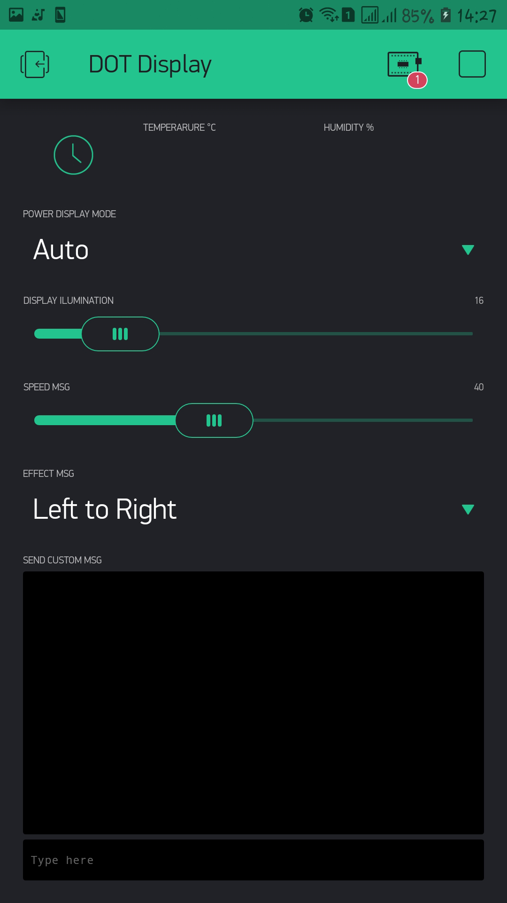

<h2>Working</h2>
<h3>Prototype</h3>
<video tittle="prototype_Movie" src="prototype/prototype_movie.mp4" width="300px">
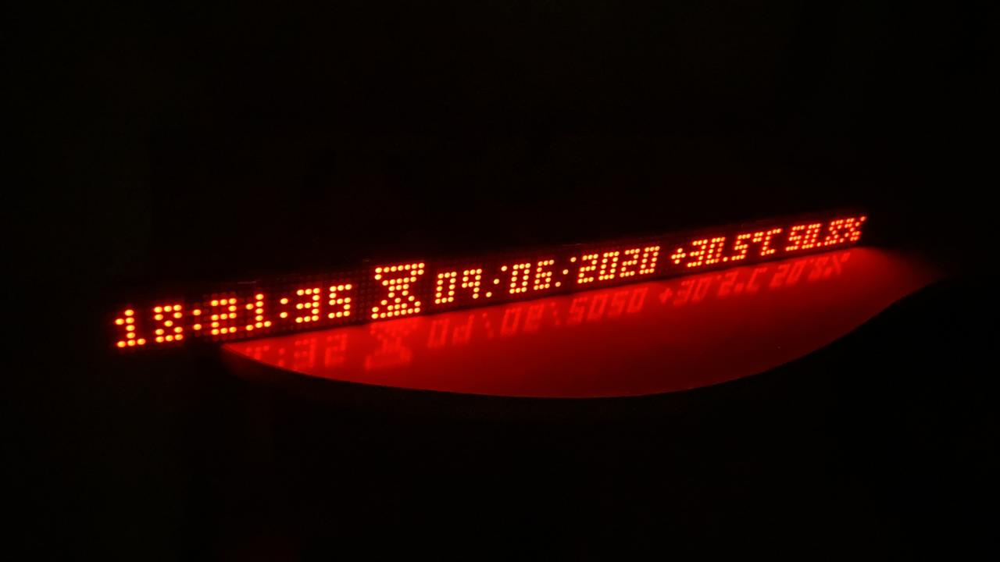
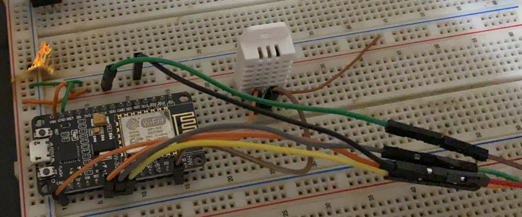

<h2>Configing App</h2>

<h3>Home</h3>

<h3>RTC</h3>
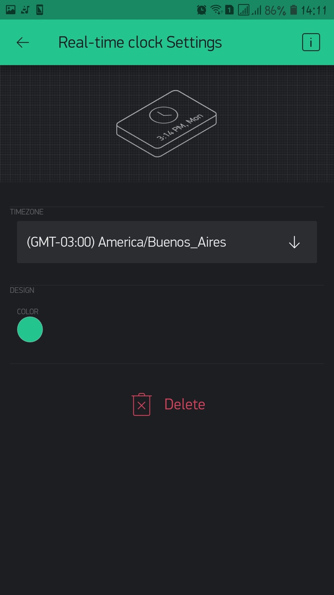

<h3>Temperature field</h3>
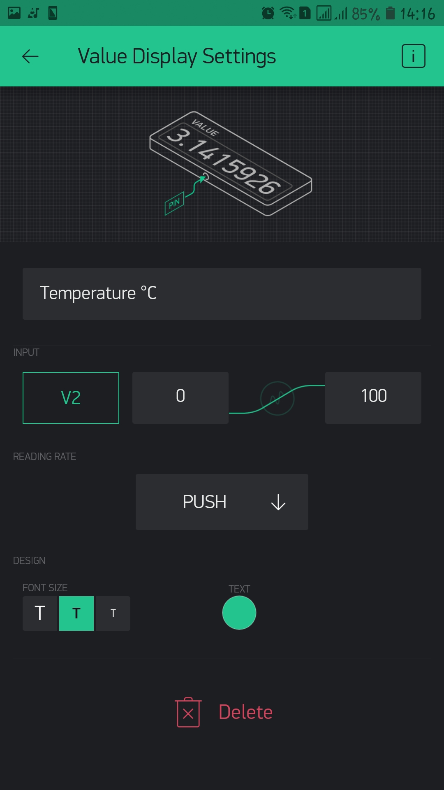

<h3>Humidity field</h3>
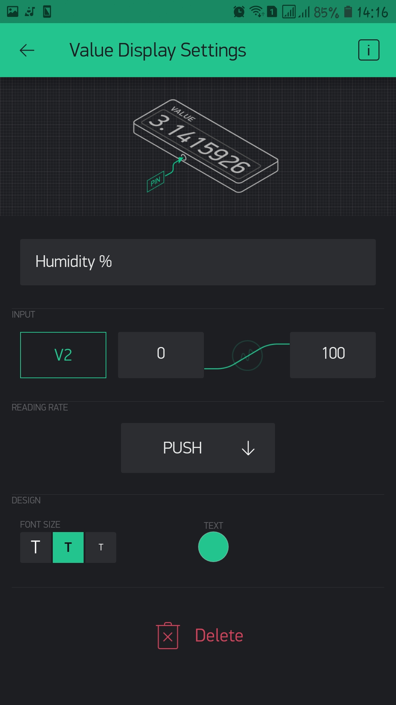

<h3>Power display mode</h3>
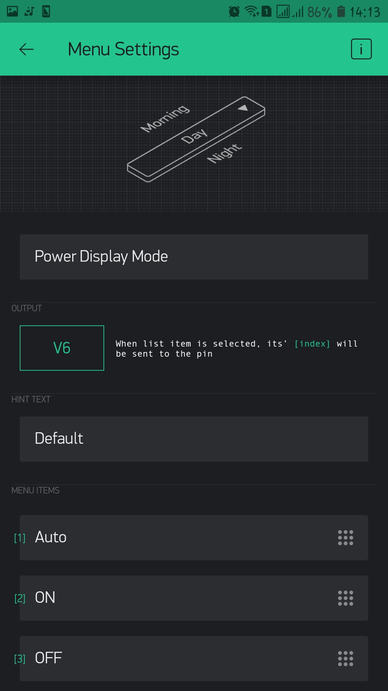

<h3>Display ilumination</h3>
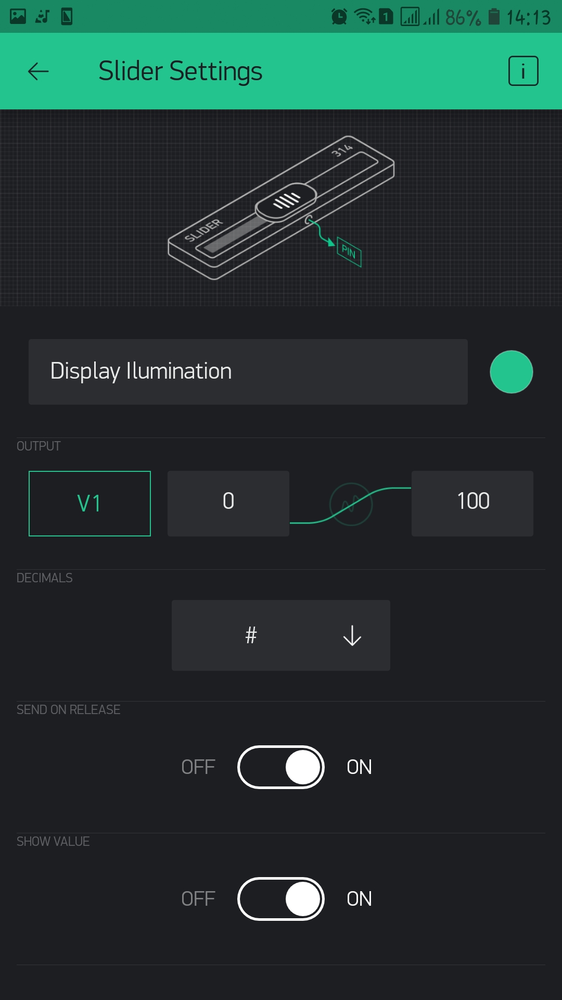

<h3>Effect type</h3>
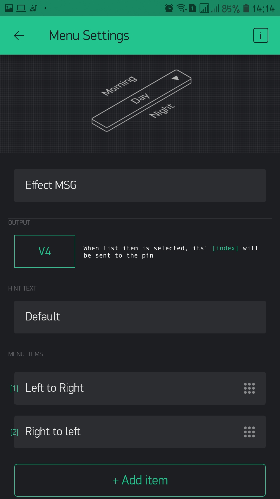

<h3>Effect speed</h3>
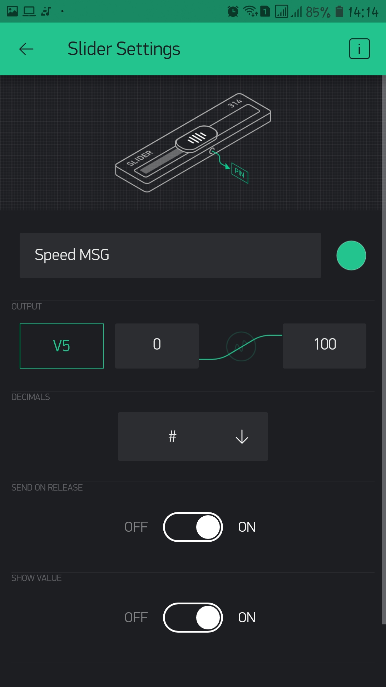

<h3>Custom message</h3>
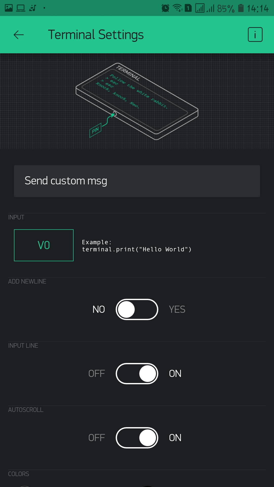
